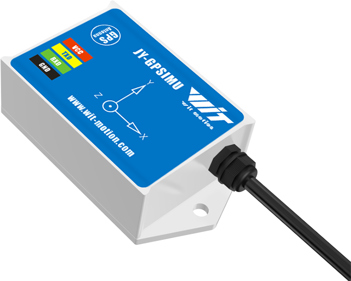

# Wit-Motion GPS/IMU Device Parser

## Introduction

I needed a IMU and a GNSS/GPS device for a project, and I fould this one on Amazon:



## Compile

```bash
gcc main.c -o main
```

## Run

```bash
./main
ACC  : 0.059570, -0.009277, 1.001465
TEMP : 33.360001
GYRO : 0.000000, 0.000000, 0.000000
ANGLE: -0.532837, -3.619995, 81.128540
VERS : 18155
MAG  : 2073, 396, -5017
PRESS: 1005.570007
ALT  : 428939665
LONG : 33.621915
LAT  : 34.919429
GPS H: 32.000000
GPS Y: 340.489990
GPS S: 0.000000
GPS N: 15
POS A: 1.100000
POS H: 0.700000
POS V: 0.900000
QUART: 0.759338, 0.016998, 1.972992, 0.649841
```

NOTE: Use CTRL-C to exit the application

## Wit Motion Standard Protocol

The device home page is here: [https://www.wit-motion.com/InertialNavigationSensor/35.html]

NOTE: The code samples are pretty awful. YMMV.

There is a protocol description document here: [https://wit-motion.gitbook.io/witmotion-sdk/wit-standard-protocol/wit-standard-communication-protocol]

NOTE: The protocol description document is not great, it doesn't give units and conversions properly, and I still have no idea what data the Altimeter is giving me or how to decode it.

## Debugging

Okay, so after debugging, it seems that we need to read one byte at a time, the device cannot handle multibyte read from the buffer, after building a readloop that begins from 0x55, we have the following:

BUF: 0x55 0x51 0x32 0x00 0x69 0x00 0x01 0x08 0x10 0x0c 0x66
BUF: 0x55 0x52 0x00 0x00 0x00 0x00 0x00 0x00 0x10 0x0c 0xc3
BUF: 0x55 0x53 0x1f 0x02 0x02 0xff 0xd6 0x05 0xeb 0x46 0xd6
BUF: 0x55 0x54 0xcb 0x00 0x61 0x0a 0x31 0xee 0x00 0x00 0xfe
BUF: 0x55 0x56 0x6b 0x8a 0x01 0x00 0xc8 0x0b 0x00 0x00 0x74
BUF: 0x55 0x57 0xc2 0x57 0xe4 0x13 0x63 0x2a 0x98 0x14 0xf5
BUF: 0x55 0x58 0x18 0x01 0xae 0x2e 0x00 0x00 0x00 0x00 0xa2
BUF: 0x55 0x59 0x9c 0x7f 0x6f 0x03 0xaf 0xfe 0x32 0x09 0x23
BUF: 0x55 0x5a 0x11 0x00 0x82 0x00 0x50 0x00 0x64 0x00 0xf6
BUF: 0x55 0x51 0x32 0x00 0x6a 0x00 0x00 0x08 0x10 0x0c 0x66
BUF: 0x55 0x52 0x00 0x00 0x00 0x00 0x00 0x00 0x10 0x0c 0xc3
BUF: 0x55 0x53 0x1e 0x02 0x02 0xff 0xd6 0x05 0xeb 0x46 0xd5
BUF: 0x55 0x54 0xca 0x00 0x7b 0x0a 0x29 0xee 0x00 0x00 0x0f
BUF: 0x55 0x56 0x6b 0x8a 0x01 0x00 0xc8 0x0b 0x00 0x00 0x74
BUF: 0x55 0x57 0xc2 0x57 0xe4 0x13 0x64 0x2a 0x98 0x14 0xf6
BUF: 0x55 0x58 0x18 0x01 0xae 0x2e 0x00 0x00 0x00 0x00 0xa2
BUF: 0x55 0x59 0x9c 0x7f 0x6f 0x03 0xaf 0xfe 0x32 0x09 0x23
BUF: 0x55 0x5a 0x11 0x00 0x82 0x00 0x50 0x00 0x64 0x00 0xf6
BUF: 0x55 0x51 0x32 0x00 0x6c 0x00 0x01 0x08 0x11 0x0c 0x6a
BUF: 0x55 0x52 0x00 0x00 0x00 0x00 0x00 0x00 0x11 0x0c 0xc4
BUF: 0x55 0x53 0x1e 0x02 0x02 0xff 0xd6 0x05 0xeb 0x46 0xd5
BUF: 0x55 0x54 0xd0 0x00 0x74 0x0a 0x2d 0xee 0x00 0x00 0x12
BUF: 0x55 0x56 0x6b 0x8a 0x01 0x00 0xc8 0x0b 0x00 0x00 0x74
BUF: 0x55 0x57 0xc2 0x57 0xe4 0x13 0x64 0x2a 0x98 0x14 0xf6
BUF: 0x55 0x58 0x18 0x01 0xae 0x2e 0x00 0x00 0x00 0x00 0xa2
BUF: 0x55 0x59 0x9c 0x7f 0x6e 0x03 0xaf 0xfe 0x32 0x09 0x22
BUF: 0x55 0x5a 0x11 0x00 0x82 0x00 0x50 0x00 0x64 0x00 0xf6
BUF: 0x55 0x51 0x2f 0x00 0x6b 0x00 0x00 0x08 0x0d 0x0c 0x61
BUF: 0x55 0x52 0x00 0x00 0x00 0x00 0x00 0x00 0x0d 0x0c 0xc0
BUF: 0x55 0x53 0x1e 0x02 0x02 0xff 0xd6 0x05 0xeb 0x46 0xd5
BUF: 0x55 0x54 0xe4 0x00 0x7b 0x0a 0x2c 0xee 0x00 0x00 0x2c
BUF: 0x55 0x56 0x6b 0x8a 0x01 0x00 0xc8 0x0b 0x00 0x00 0x74

NOTE: we need the CRC in place to throw data that does not have the full 11 bytes because there may be a 0x55 in the byte buffer that kills the read loop.